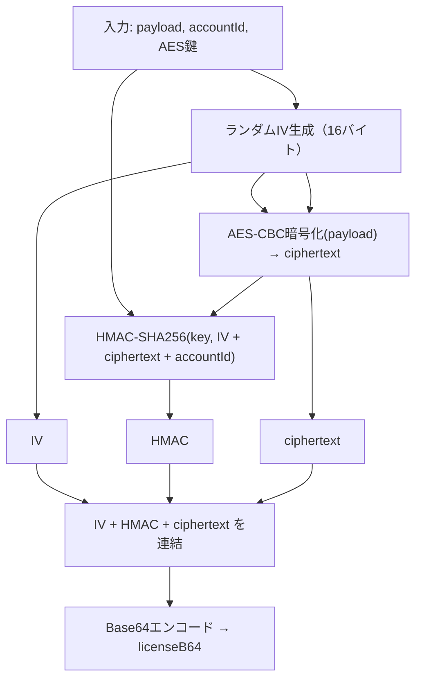
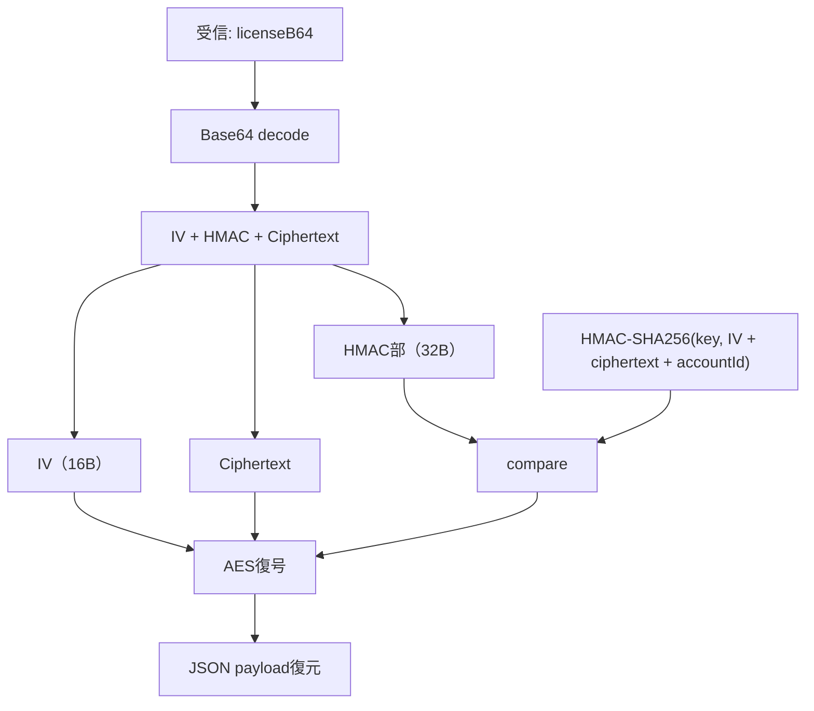

# SANKY License System

<p align="center">
  
</p>


---
## 🧾 概要

**SANKY License System** は、MetaTrader 向けの EA に対して、安全かつ柔軟なライセンス認証を提供するシステムです。  
AES-CBC による暗号化と HMAC-SHA256 による改ざん検出を組み合わせることで、**通信不要・高セキュリティ・再配布防止**を実現します。

- ✅ **配布されるライセンスファイルはBase64エンコード済みの自己完結型トークン**
- ✅ **accountId（口座番号）と強く結び付けられており、流用不可**
- ✅ **payloadはJSON形式であり、期限や機能制御が可能**
- ✅ **完全オフライン環境でもEA単体で検証可能**

このドキュメントでは、暗号化処理と復号処理のロジックを図解とともに説明し、システム全体の構成意図を明らかにします。

---


## 🔒 暗号化処理



---

## 🧪 復号処理



---

## 🧠 処理説明と設計の狙い

### 🔐 暗号化の目的
- 利用者に配布するライセンス文字列に、**機密性（AES-CBC）**と**完全性（HMAC）**の両方を担保
- HMACは `IV + ciphertext + accountId` を対象とするため、
  - 改ざん（bit flip攻撃）
  - 他人のライセンス流用（accountId差し替え）
  がいずれも失敗する構造

### 📦 payload構造と拡張性

暗号化対象である `payload` は **JSONフォーマット** を採用し、以下のような柔軟な制御が可能です：

```json
{
  "name": "Example User",
  "email": "user@example.com",
  "expiryDate": "2025-12-31",
  "features": ["basic", "pro"]
}
```

この形式により：

- ✅ ライセンスの**有効期限**制御（expiryDate）  
- ✅ 機能制限（`features` によるプラン制御）  
- ✅ ユーザー情報の照合や内部ログ出力にも活用可能

### 🛡 安全設計ポイント

- AES鍵は256bit（32バイト）、IVは毎回ランダム生成
- HMAC-SHA256の結果は32バイト（256bit）
- `accountId` をHMACに混ぜることで、**EAが特定口座でのみ起動可能**な仕組みを構成

---

## ✅ 結論

この方式により、**通信なしでEAが自律的にライセンスを検証・制御**でき、  
配布・運用・セキュリティのすべての面で高いスケーラビリティを確保します。
