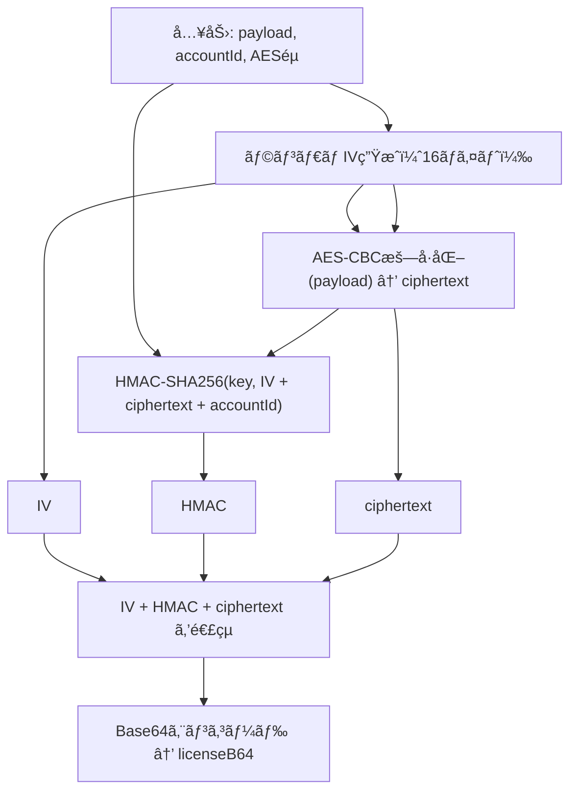
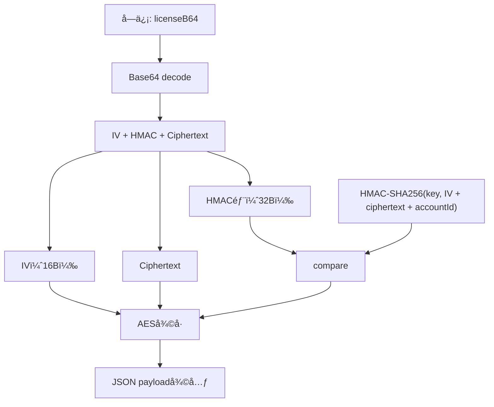

# SANKY License System

<p align="center">
  
</p>


---
## 🧾 概è¦

**SANKY License System** ã¯ã€MetaTrader å‘ã‘ã® EA ã«å¯¾ã—ã¦ã€å®‰å…¨ã‹ã¤æŸ”軟ãªãƒ©ã‚¤ã‚»ãƒ³ã‚¹èªè¨¼ã‚’æä¾›ã™ã‚‹ã‚·ã‚¹ãƒ†ãƒ ã§ã™ã€‚  
AES-CBC ã«ã‚ˆã‚‹æš—å·åŒ–㨠HMAC-SHA256 ã«ã‚ˆã‚‹æ”¹ã–ん検出を組ã¿åˆã‚ã›ã‚‹ã“ã¨ã§ã€**通信ä¸è¦ãƒ»é«˜ã‚»ã‚­ãƒ¥ãƒªãƒ†ã‚£ãƒ»å†é…布防止**を実ç¾ã—ã¾ã™ã€‚

- ✅ **é…布ã•ã‚Œã‚‹ãƒ©ã‚¤ã‚»ãƒ³ã‚¹ãƒ•ã‚¡ã‚¤ãƒ«ã¯Base64エンコード済ã¿ã®è‡ªå·±å®Œçµåž‹ãƒˆãƒ¼ã‚¯ãƒ³**
- ✅ **accountId（å£åº§ç•ªå·ï¼‰ã¨å¼·ãçµã³ä»˜ã‘られã¦ãŠã‚Šã€æµç”¨ä¸å¯**
- ✅ **payloadã¯JSONå½¢å¼ã§ã‚ã‚Šã€æœŸé™ã‚„機能制御ãŒå¯èƒ½**
- ✅ **完全オフライン環境ã§ã‚‚EAå˜ä½“ã§æ¤œè¨¼å¯èƒ½**

ã“ã®ãƒ‰ã‚­ãƒ¥ãƒ¡ãƒ³ãƒˆã§ã¯ã€æš—å·åŒ–処ç†ã¨å¾©å·å‡¦ç†ã®ãƒ­ã‚¸ãƒƒã‚¯ã‚’図解ã¨ã¨ã‚‚ã«èª¬æ˜Žã—ã€ã‚·ã‚¹ãƒ†ãƒ å…¨ä½“ã®æ§‹æˆæ„図を明らã‹ã«ã—ã¾ã™ã€‚

---

## 🧠 処ç†èª¬æ˜Žã¨è¨­è¨ˆã®ç‹™ã„

### 🔠暗å·åŒ–ã®ç›®çš„
- 利用者ã«é…布ã™ã‚‹ãƒ©ã‚¤ã‚»ãƒ³ã‚¹æ–‡å­—列ã«ã€**機密性（AES-CBC）**ã¨**完全性（HMAC）**ã®ä¸¡æ–¹ã‚’æ‹…ä¿
- HMAC㯠`IV + ciphertext + accountId` を対象ã¨ã™ã‚‹ãŸã‚ã€
  - 改ã–ん（bit flip攻撃）
  - 他人ã®ãƒ©ã‚¤ã‚»ãƒ³ã‚¹æµç”¨ï¼ˆaccountIdå·®ã—替ãˆï¼‰
  ãŒã„ãšã‚Œã‚‚失敗ã™ã‚‹æ§‹é€ 

### 📦 payload構造ã¨æ‹¡å¼µæ€§

æš—å·åŒ–対象ã§ã‚ã‚‹ `payload` 㯠**JSONフォーマット** を採用ã—ã€ä»¥ä¸‹ã®ã‚ˆã†ãªæŸ”軟ãªåˆ¶å¾¡ãŒå¯èƒ½ã§ã™ï¼š

```json
{
  "name": "Example User",
  "email": "user@example.com",
  "expiryDate": "2025-12-31",
  "features": ["basic", "pro"]
}
```

ã“ã®å½¢å¼ã«ã‚ˆã‚Šï¼š

- ✅ ライセンスã®**有効期é™**制御（expiryDate）  
- ✅ 機能制é™ï¼ˆ`features` ã«ã‚ˆã‚‹ãƒ—ラン制御）  
- ✅ ユーザー情報ã®ç…§åˆã‚„内部ログ出力ã«ã‚‚活用å¯èƒ½

### 🛡 安全設計ãƒã‚¤ãƒ³ãƒˆ

- AESéµã¯256bit（32ãƒã‚¤ãƒˆï¼‰ã€IVã¯æ¯Žå›žãƒ©ãƒ³ãƒ€ãƒ ç”Ÿæˆ
- HMAC-SHA256ã®çµæžœã¯32ãƒã‚¤ãƒˆï¼ˆ256bit）
- `accountId` ã‚’HMACã«æ··ãœã‚‹ã“ã¨ã§ã€**EAãŒç‰¹å®šå£åº§ã§ã®ã¿èµ·å‹•å¯èƒ½**ãªä»•çµ„ã¿ã‚’構æˆ

---

## ✅ çµè«–

ã“ã®æ–¹å¼ã«ã‚ˆã‚Šã€**通信ãªã—ã§EAãŒè‡ªå¾‹çš„ã«ãƒ©ã‚¤ã‚»ãƒ³ã‚¹ã‚’検証・制御**ã§ã〠 
é…布・é‹ç”¨ãƒ»ã‚»ã‚­ãƒ¥ãƒªãƒ†ã‚£ã®ã™ã¹ã¦ã®é¢ã§é«˜ã„スケーラビリティを確ä¿ã—ã¾ã™ã€‚


## 🔒 æš—å·åŒ–処ç†


```mermaid
flowchart TD
    A["入力: payload, accountId, AESéµ"]
    B["ランダムIV生æˆï¼ˆ16ãƒã‚¤ãƒˆï¼‰"]
    C["AES-CBCæš—å·åŒ–(payload) → ciphertext"]
    D["HMAC-SHA256(key, IV + ciphertext + accountId)"]
    E1["IV"]
    E2["HMAC"]
    E3["ciphertext"]
    F["IV + HMAC + ciphertext を連çµ"]
    G["Base64エンコード → licenseB64"]

    A --> B --> C
    A --> D
    B --> C
    C --> D
    D --> E2
    B --> E1
    C --> E3
    E1 --> F
    E2 --> F
    E3 --> F
    F --> G
```

---

## 🧪 復å·å‡¦ç†


```mermaid
flowchart TD
    A["å—ä¿¡: licenseB64"]
    B["Base64 decode"]
    C["IV + HMAC + Ciphertext"]
    D1["IV（16B）"]
    D2["HMAC部（32B）"]
    D3["Ciphertext"]
    E["HMAC-SHA256(key, IV + ciphertext + accountId)"]
    F["compare"]
    G["AES復å·"]
    H["JSON payload復元"]

    A --> B --> C
    C --> D1
    C --> D2 --> F
    C --> D3
    E --> F
    D1 --> G
    D3 --> G
    F --> G
    G --> H
```

---

