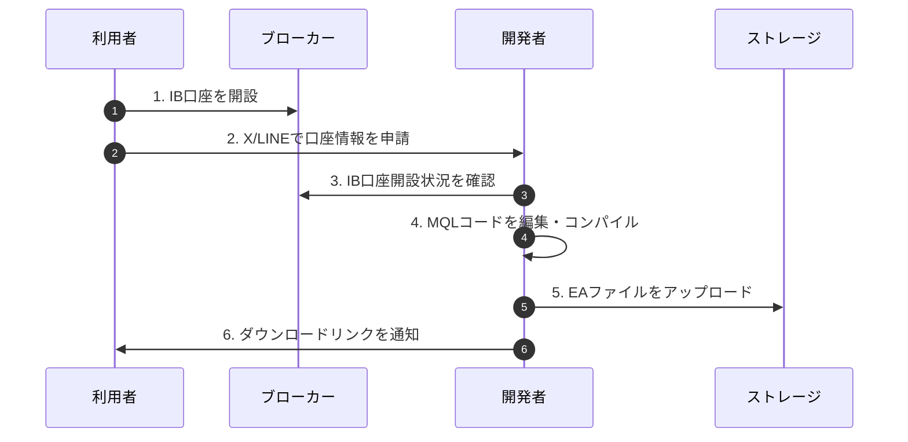
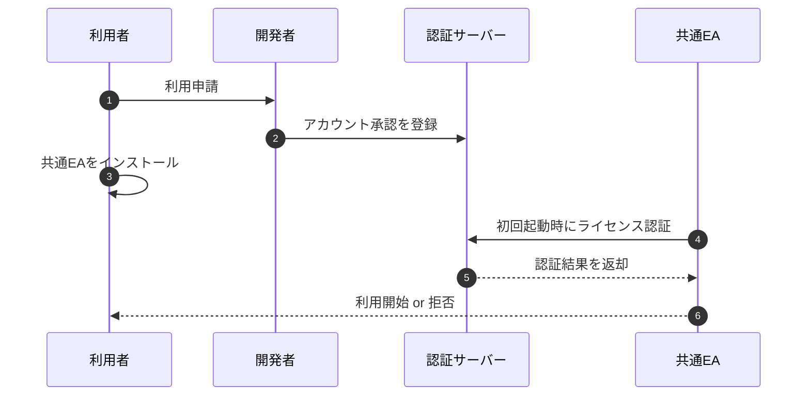
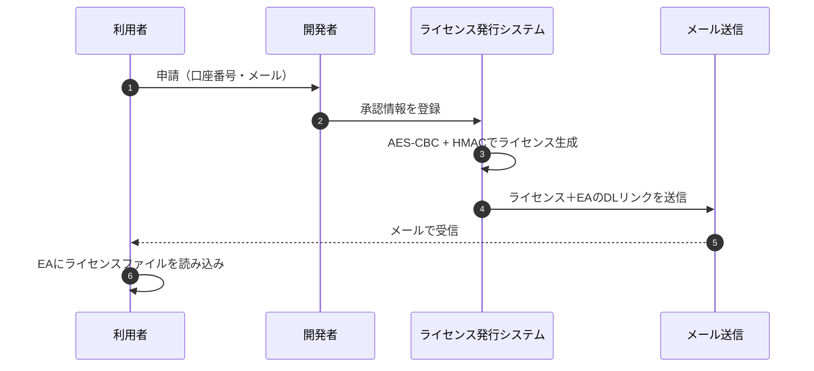
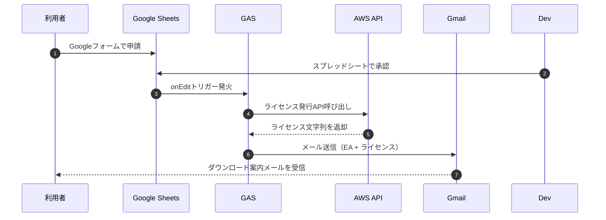
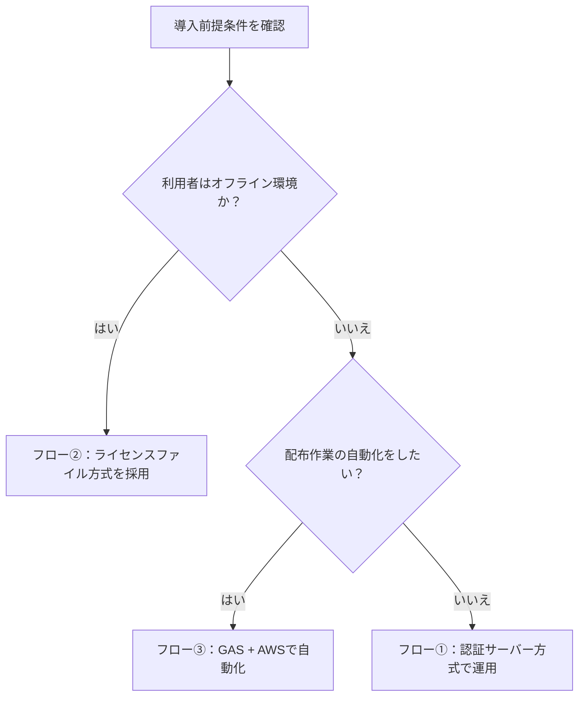

# EA配布・ライセンス認証に関する構成検討まとめ

---

## 📌 現行フローと課題

### 現行フロー概要（手動コンパイル方式）

### 主な課題

| 項目 | 内容 |
|------|------|
| 🧑‍💻 手動作業の負荷 | 利用者ごとにコンパイル・通知が必要 |
| ⏳ スケーラビリティ欠如 | 利用者増加に比例して作業が膨張 |
| 🔁 アップデートの手間 | バージョン更新のたびに全EAを再コンパイル |
| 📤 管理困難 | ダウンロードURLの手動配布や記録漏れリスク |

---

## ✅ 検討した3つの改善フロー

---

### フロー1：初回アクティベーション方式

**構成要素：**

| コンポーネント | 技術 |
|----------------|------|
| EA本体 | MQL + DLL |
| 認証API | AWS API Gateway + Lambda |
| 承認DB | DynamoDB or S3 |

---

### フロー2：ライセンスファイル配布方式（オフライン対応）

**構成要素：**

| コンポーネント | 技術 |
|----------------|------|
| EA本体 | MQL + DLL |
| ライセンス発行 | AWS Lambda |
| 配布 | メール通知 or ストレージURL |

---

### フロー3：スプレッドシート＋GAS＋AWS連携による自動配布

**構成要素：**

| コンポーネント | 技術 |
|----------------|------|
| 管理 | Google Sheets |
| 自動処理 | Google Apps Script |
| ライセンスAPI | AWS API Gateway + Lambda |
| メール通知 | Gmail API / SendGrid |

---

## 🔍 ライセンス運用3方式の比較一覧

| 観点 | フロー①: 初回アクティベーション方式 | フロー②: ライセンスファイル配布方式 | フロー③: スプレッドシート + GAS + AWS連携 |
|------|------------------------------------|------------------------------------|----------------------------------------|
| 🔒 認証方法 | 起動時にサーバーと通信して認証 | ローカルでライセンスファイル検証 | GAS経由でAPIからライセンス発行＋配布 |
| 🌐 通信要件 | 初回時にインターネット通信必須 | 完全オフラインで動作可能 | オンラインでメール送信後はオフライン動作可能 |
| 📦 配布物 | EA単体（共通ビルド） | EA + ライセンスファイル（2ファイル） | EA + ライセンスファイル（自動送信） |
| 🔁 バージョン更新時 | EAファイル差し替えで即時反映 | EAファイル差し替え＋再送要（手動 or バッチ） | EAファイル差し替えのみ（再送自動化可能） |
| 🧠 スケーラビリティ | 高（人数増でも負荷一定） | 中（ライセンス再発行に対応必要） | 中〜高（GAS連携の自動化範囲次第） |
| 🧰 開発・運用コスト | 中〜高：ドメイン、認証API、監視が必要 | 低：ローカル生成＋配布手段構築だけでOK | 最小：無料Google環境 + AWS API呼出のみ |
| 💰 ランニングコスト | 中：API Gateway + Lambda + 独自ドメイン | 低：Lambda実行コストのみ（~無料枠内） | 低：GAS無料 + AWS API無料枠で運用可能 |
| 🌍 ドメイン要否 | ✅ 必須（HTTPS公開エンドポイント） | ❌ 不要（オフライン） | ❌ 不要（GAS→API直呼び） |
| 📧 配布自動化 | ❌（別途通知システムが必要） | ❌（手動送信 or 別システム必要） | ✅ メール送信までGASで全自動化可能 |
| 📊 ログ管理 | サーバー側でアクティベーション履歴取得可 | ローカル実行なので要別設計 | Google Sheetsでログ残せる |
| 🛡 セキュリティ | 高：HMAC + 認証サーバー照合 | 高：HMAC + ローカル検証 | 高：API連携の結果をメール送信、通信は限定的 |

## 🤔 導入意思決定フロー

