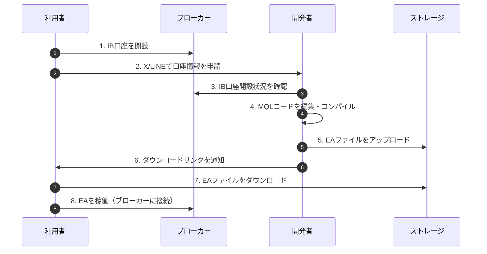
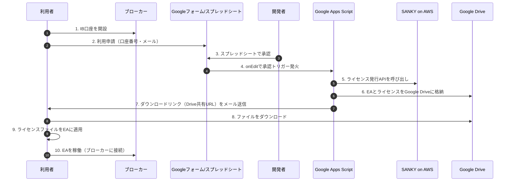

# EA配布モデル検討

---

## 🧾 概要

本ドキュメントは、MetaTrader（MT4/MT5）向けのEA配布における課題を解決するために、
安全かつスケーラブルなライセンス配布・認証モデルを比較・整理したものです。

- ✅ 利用者ごとに手動でEAをコンパイル・配布する運用の限界
- ✅ バージョンアップ時の再配布・誤送信などの負担
- ✅ ライセンス不正利用の防止（口座縛り、改ざん対策）
- ✅ オフライン利用可能性の確保（取引所やVPN環境下）

---

## 📌 現行フローと課題

### 現行フロー（手動コンパイル＆配布モデル）

### 主な課題

| 項目 | 内容 |
|------|------|
| 🧑‍💻 手動作業の負荷 | 利用者ごとにコンパイル・通知が必要 |
| ⏳ スケーラビリティ欠如 | 利用者増加に比例して作業が膨張 |
| 🔁 アップデートの手間 | バージョン更新のたびに全EAを再コンパイル |
| 📤 管理困難 | ダウンロードURLの手動配布や記録漏れリスク |

---

---

## 🧭 承認付き 自動ライセンス配布モデル（Google連携）

---

## ✅ 現行フロー vs 承認付き 自動ライセンス配布モデル（比較表）

| 比較項目 | 現行フロー（手動コンパイル配布） | 承認付き 自動ライセンス配布モデル |
|----------|-----------------------------|------------------------------|
| 🧑‍💻 配布作業 | 利用者ごとにMQL修正・コンパイルが必要 | 共通EAを配布、申請承認後に自動通知 |
| 🔁 バージョン更新時 | 全利用者分を再コンパイル・再配布 | EA差し替えのみ |
| 📨 通知手段 | X/LINEなど手動連絡が中心 | GAS + Gmailで自動送信 |
| 📦 配布ファイル構成 | 口座縛り済みEAファイル1点 | 共通EA + 個別ライセンスファイル |
| ⏳ スケーラビリティ | 人数増加に比例して作業が膨張 | 利用者増加に対して自動処理で対応可能 |
| 🛡 セキュリティ | ファイル改ざん対策・流用制限に限界あり | AES-CBC + HMAC による改ざん防止・口座縛り対応 |
| 🛰 オフライン動作 | 配布後はオフライン利用可 | 完全にオフラインで動作（起動時に外部接続不要） |
| 💰 ランニングコスト | 管理作業コスト高、クラウド費用不要 | Google環境無料枠 + AWS Lambda程度（軽微） |
| 📊 ログ管理 | 分散・記録漏れの可能性あり | Google Sheetsで一元化された履歴管理が可能 |
| 🛠 構築難度 | 作業負荷は低いが属人化しやすい | 初期構築は必要だが属人性を排除可能 |

---

## 🧾 結論

> **SANKY License System における推奨方式は、「承認付き 自動ライセンス配布モデル」への一本化です。**

理由は以下の通りです：

- ✅ 配布・通知の自動化により**人手を介さない拡張運用**が可能
- ✅ ライセンス認証の信頼性と改ざん防止機能を強化
- ✅ Google Drive や GAS との連携により、**無償で運用開始できる軽量な構成**
- ✅ 申請～承認～配布までを一元化し、**属人性のない管理体制**を構築
